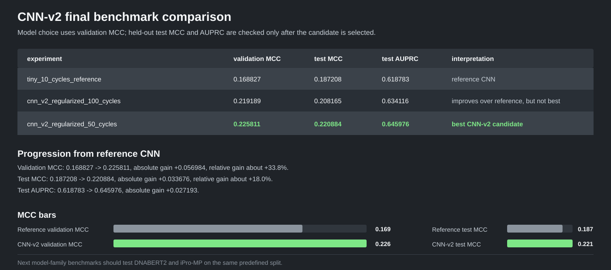

# SeqTrainer Promoter Benchmark Results

This is the project-level summary of the CNN, CNN-v2, DNABERT2, and iPro-MP
promoter-classification experiments.

## Fixed Scientific Contract

The claim-bearing comparisons use the following rules:

| Item | Fixed value |
| --- | --- |
| Task | Binary bacterial promoter prediction |
| Dataset | GSE144621, `EP_DNA_BERT2_genomic_order` |
| Train split | `train_EP_DNA_BERT2_genomic_order.csv` |
| Validation split | `eval_EP_DNA_BERT2_genomic_order.csv` |
| Test split | `test_EP_DNA_BERT2_genomic_order.csv` |
| Rows | 136,484 train; 19,498 validation; 38,996 test |
| Labels | `0` = background; `1` = promoter-positive |
| Biological sequence length | 300 bp |
| Random seed | 42 |
| Split strategy | Predefined files; no new split generated per model |
| Model selection | Validation data only |
| Threshold | Selected by validation MCC |
| Test set | Held out until final reporting |
| Primary metrics | MCC, then AUPRC |
| Supporting metrics | Accuracy, balanced accuracy, precision, recall/sensitivity, specificity, F1, AUROC, confusion matrix, loss |
| Imbalance policy | Applied only if training data is imbalanced; disabled here because the training ratio is 1.003 |

The same validation-selected threshold is used for validation and test reporting.
No threshold, checkpoint, or hyperparameter is selected from test results.

## Held-Out Test Results

Values below are from the test split. The earlier DNABERT2 T4 run and iPro-MP
run are retained for transparency but are not both canonical same-split claims.

| Model/run | Accuracy | Balanced accuracy | Precision | Recall | F1 | MCC | Specificity | AUROC | AUPRC | Status |
| --- | ---: | ---: | ---: | ---: | ---: | ---: | ---: | ---: | ---: | --- |
| CNN reference, 10 cycles | 0.568622 | 0.566921 | 0.720034 | 0.217647 | 0.334257 | 0.187208 | 0.916195 | 0.599882 | 0.618783 | Canonical reference |
| CNN-v2, 50 cycles | 0.578239 | 0.576483 | 0.772091 | 0.216152 | 0.337749 | **0.220884** | 0.936814 | 0.610727 | **0.645976** | Current best |
| CNN-v2, 100 cycles | 0.574315 | 0.572571 | 0.753849 | 0.214503 | 0.333975 | 0.208165 | 0.930638 | 0.601339 | 0.634116 | Longer run; lower than 50 cycles |
| DNABERT2 frozen v1 | 0.557262 | 0.556231 | 0.595158 | 0.344586 | **0.436466** | 0.124165 | 0.767876 | 0.573813 | 0.575073 | Frozen baseline |
| DNABERT2 final training | 0.570751 | 0.569059 | 0.724242 | 0.221718 | 0.339502 | 0.192182 | 0.916399 | 0.600569 | 0.624236 | Canonical shared split |
| DNABERT2 earlier T4 full fine-tuning | 0.683493 | 0.529984 | 0.679803 | 0.078098 | 0.140102 | 0.147631 | 0.981870 | 0.531969 | 0.365169 | Historical, different split |
| iPro-MP E. coli five-fold ensemble, shared-split rerun | 0.529721 | 0.528003 | 0.592650 | 0.175385 | 0.270671 | 0.079025 | 0.880621 | 0.545476 | 0.547796 | Latest canonical inference result; threshold 0.471795 |
| iPro-MP E. coli five-fold ensemble, earlier run | 0.628842 | 0.528845 | 0.395293 | 0.234484 | 0.294358 | 0.068364 | 0.823207 | 0.541454 | 0.372180 | Historical; different split/audit state |

### Current decision

CNN-v2 with 50 cycles is the current baseline to beat:

- Test MCC: `0.220884`
- Test AUPRC: `0.645976`

The final DNABERT2 run improved over the CNN reference and frozen DNABERT2,
but remains below CNN-v2 by `0.028702` MCC and `0.021740` AUPRC.

The latest canonical iPro-MP rerun is below CNN-v2 by `0.141859` MCC and
`0.098180` AUPRC. Its validation-selected threshold was `0.471795`; that same
threshold was used for the test row. The iPro-MP result is therefore directly
comparable under the shared split and validation-only threshold policy, but it
does not become the primary baseline.

### Latest iPro-MP shared-split result

| Split | Threshold | Accuracy | Balanced accuracy | Precision | Recall / sensitivity | F1 | MCC | Specificity | TN | FP | FN | TP | AUROC | AUPRC |
| --- | ---: | ---: | ---: | ---: | ---: | ---: | ---: | ---: | ---: | ---: | ---: | ---: | ---: | ---: |
| Validation | 0.471795 | 0.531644 | 0.531316 | 0.608339 | 0.175257 | 0.272119 | 0.089218 | 0.887374 | 8,659 | 1,099 | 8,033 | 1,707 | 0.549863 | 0.550500 |
| Test | 0.471795 | 0.529721 | 0.528003 | 0.592650 | 0.175385 | 0.270671 | 0.079025 | 0.880621 | 17,254 | 2,339 | 16,000 | 3,403 | 0.545476 | 0.547796 |

This iPro-MP run is inference-only: the five official E. coli fold models were
loaded, their positive-class probabilities were averaged, and SeqTrainer chose
the final threshold on validation MCC. There are no SeqTrainer epochs or
learning-rate updates for this baseline. The low test MCC and AUROC indicate
weak separation on this promoter dataset, despite relatively high precision and
specificity at the selected threshold.

## What Changed In Each Model

| Model | Representation | Main changes | Training status |
| --- | --- | --- | --- |
| CNN reference | 300 bp one-hot encoding over A/C/G/T/N | Two Conv1d layers, ReLU, max pooling, Adam at `1e-3`, batch size 16, 10 cycles, no scheduler, dropout, or weight decay | Entire CNN trained; final-cycle reference |
| CNN-v2 | Same one-hot input | Wider/deeper CNN, batch normalization, GELU, dilated convolutions, average plus max pooling, dropout, AdamW, OneCycleLR, best validation-MCC checkpointing | 50-cycle candidate selected; 100-cycle comparison was lower |
| DNABERT2 frozen v1 | Native DNABERT2 tokenization and cached 768-dimensional embeddings | Encoder frozen; only the classifier head is trained; no encoder fine-tuning | Frozen baseline |
| DNABERT2 final training | Native DNABERT2 tokenization, mean pooling, token limit 104 | Full encoder fine-tuning, AdamW at `1e-5`, dropout `0.2`, effective batch size 32, six maximum epochs, early stopping patience 2 | Best validation MCC checkpoint; best epoch was 3 |
| iPro-MP | Official DNABERT-6 6-mer model | Five official E. coli fold checkpoints loaded sequentially; probabilities averaged; no SeqTrainer training | Inference-only; epochs and learning rate do not apply |

### DNABERT2 final-training specifications

| Setting | Value |
| --- | --- |
| Notebook | `notebooks/final_training/dnabert2-finetune-kaggle.ipynb` |
| TOML | `notebooks/final_training/config/dnabert2_final_training_t4.toml` |
| Backbone | `zhihan1996/DNABERT-2-117M` |
| Mode | Full encoder fine-tuning |
| Seed | 42 |
| Maximum epochs | 6 |
| Early stopping | Patience 2 on validation MCC |
| Physical batch size | 2 |
| Gradient accumulation | 16; effective batch size 32 |
| Learning rate | `1e-5` |
| Weight decay | `0.01` |
| Warmup ratio | `0.08` |
| Dropout | `0.2` |
| Precision | FP16 |
| Pooling | Mean pooling |
| Token limit | 104 |
| Threshold | `0.677002`, selected on validation MCC |

The final archive used the canonical split hashes and produced the standard
metrics, predictions, manifest, history, and best-checkpoint artifacts. Its
recorded runtime was Kaggle with Python 3.12, Torch 2.10.0, and Transformers
4.41.2, although the TOML describes the intended Colab T4 environment. Pin the
actual runtime and SeqTrainer commit before making a bit-for-bit reproduction
claim.

## Reproduction Links

- CNN notebooks: `notebooks/benchmark_sg/cnn_benchmark/`
- Final DNABERT2 notebook: `notebooks/final_training/dnabert2-finetune-kaggle.ipynb`
- iPro-MP T4/A100 notebooks: `notebooks/colab_benchmarks/`

For full per-split metrics, confusion counts, histories, and model-specific
notes, see the detailed result files in the model benchmark folders.
