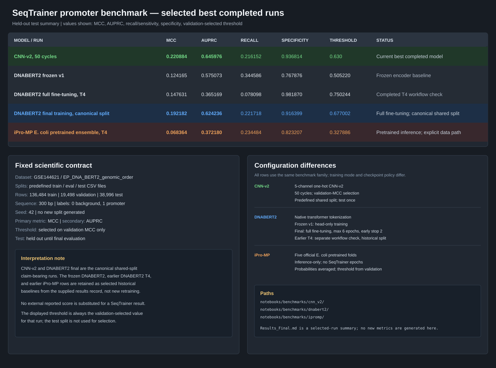

# SeqTrainer Promoter Benchmark Results

This summary intentionally contains only the five selected completed runs, in
the requested order. The comparison graphic combines the result rows, fixed
scientific contract, and the main split/training differences.

## Selected rows

| Model/run | MCC | AUPRC | Recall / sensitivity | Specificity | Validation threshold | Status |
| --- | ---: | ---: | ---: | ---: | ---: | --- |
| CNN-v2, 50 cycles | 0.220884 | 0.645976 | 0.216152 | 0.936814 | 0.630 | Current best completed model |
| DNABERT2 frozen v1 | 0.124165 | 0.575073 | 0.344586 | 0.767876 | 0.505220 | Frozen encoder baseline |
| DNABERT2 full fine-tuning, T4 | 0.147631 | 0.365169 | 0.078098 | 0.981870 | 0.750244 | Completed T4 workflow check |
| DNABERT2 final training, canonical split | 0.192182 | 0.624236 | 0.221718 | 0.916399 | 0.677002 | Full fine-tuning; canonical shared split |
| iPro-MP E. coli pretrained ensemble, T4 | 0.068364 | 0.372180 | 0.234484 | 0.823207 | 0.327886 | Pretrained inference; explicit data path |

The displayed values are retained from the recorded benchmark artifacts. This
file does not retrain models or introduce external model scores.
CNN-v2 and DNABERT2 final are the canonical shared-split claim-bearing runs;
the other selected rows are historical baselines shown for context.

## Reproduction files

- CNN-v2: [`notebooks/benchmarks/cnn_v2/`](notebooks/benchmarks/cnn_v2/)
- DNABERT2: [`notebooks/benchmarks/dnabert2/`](notebooks/benchmarks/dnabert2/)
- iPro-MP: [`notebooks/benchmarks/ipromp/`](notebooks/benchmarks/ipromp/)

Only a completed full-data run using the fixed contract should be used to add
or replace a claim-bearing result.
