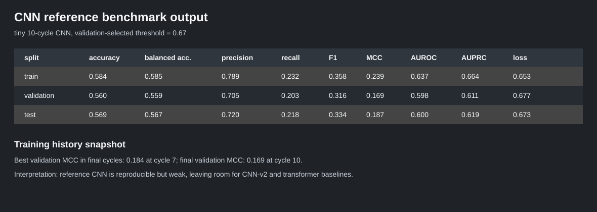

# CNN Promoter Benchmark

This folder contains the Colab-ready CNN benchmark notebooks for the shared E. coli promoter classification split.

The purpose is to make the CNN baseline reproducible before comparing against DNABERT2 and iPro-MP. The reference notebook preserves the original CNN baseline. The CNN-v2 notebook gives CNN one final stronger attempt before moving to DNABERT2.

## Files

- `cnn_reference_benchmark_colab.ipynb`: original/reference 10-cycle CNN baseline.
- `cnn_v2_final_benchmark_colab.ipynb`: final CNN-v2 check with two regularized enhanced CNN candidates.
- `assets/cnn_reference_benchmark_metrics.svg`: reference CNN result snapshot.
- `assets/cnn_v2_mcc_comparison.svg`: CNN-v2 comparison snapshot.

## Dataset

Task: binary bacterial promoter prediction from fixed-length DNA sequence windows.

Source accession: [GSE144621](https://www.ncbi.nlm.nih.gov/geo/query/acc.cgi?acc=GSE144621)

Benchmark config: [`config-examples/benchmarks/cnn.toml`](../../../config-examples/benchmarks/cnn.toml)

Bundled repo data archive: [`data/data_DNABERT/promoter_classification_DNABERT.zip`](../../../data/data_DNABERT/promoter_classification_DNABERT.zip)

The archive contains the predefined split files:

- `train_EP_DNA_BERT2_genomic_order.csv`
- `eval_EP_DNA_BERT2_genomic_order.csv`
- `test_EP_DNA_BERT2_genomic_order.csv`

The notebooks extract these files into:

```text
data/promoter_classification/
```

Google Drive copy of the split data:
[AIxBio promoter classification data](https://drive.google.com/drive/folders/1rH47oJEjQjkJvHXKX_rwDjDb--dGPGx2)

## Run On Colab

Open:

- [CNN reference benchmark in Colab](https://colab.research.google.com/github/simplyshree/SeqTrainer/blob/issue-3-cnn-baseline-reproduction/notebooks/benchmarks/cnn_benchmark/cnn_reference_benchmark_colab.ipynb)
- [CNN-v2 final benchmark in Colab](https://colab.research.google.com/github/simplyshree/SeqTrainer/blob/issue-3-cnn-baseline-reproduction/notebooks/benchmarks/cnn_benchmark/cnn_v2_final_benchmark_colab.ipynb)

After this branch is merged, replace `issue-3-cnn-baseline-reproduction` in the Colab URL with `dev`.

Use a GPU runtime for `cnn_v2_final_benchmark_colab.ipynb`:

```text
Runtime > Change runtime type > GPU
```

Run cells from top to bottom.

## Data Options

### Option 1: Use The Bundled Repo ZIP

No Drive setup is required. If Drive is unavailable, the notebooks automatically extract:

```text
data/data_DNABERT/promoter_classification_DNABERT.zip
```

into:

```text
data/promoter_classification/
```

This is the simplest reproducible path for reviewers.

### Option 2: Use Google Drive Data

If using Drive, put the three CSV files in:

```text
MyDrive/AIxBio/Promoter Classification/Data/
```

The notebooks check that path automatically after mounting Drive.

If your Drive folder is somewhere else, edit this line in the dataset-preparation cell:

```python
expected_relative_dir = Path("AIxBio") / "Promoter Classification" / "Data"
```

Do not change the split filenames unless the benchmark config is also updated.

### Option 3: Run Locally

From the repository root:

```bash
python -m pip install -e ".[torch]"
python -m zipfile -e data/data_DNABERT/promoter_classification_DNABERT.zip data/promoter_classification
jupyter notebook notebooks/benchmarks/cnn_benchmark
```

For local notebook runs, either skip the Colab clone/setup cell or change:

```python
REPO_DIR = Path("/content/SeqTrainer")
```

to:

```python
REPO_DIR = Path.cwd()
```

Run the notebook from the repository root so relative paths resolve correctly.

## Metrics

Thresholds are selected on the validation split using MCC. Final claims should be made from the held-out test split after the candidate is chosen.

Primary model-selection metric:

- `validation MCC`: robust single-number metric for binary classification, especially when class balance may change in future datasets.

Primary final-report metrics:

- `test MCC`: final held-out correlation between predicted and true labels.
- `test AUPRC`: precision-recall summary, useful when promoter/non-promoter balance may be uneven.

Supporting metrics:

- `accuracy`: plain fraction correct; reported but not used alone for model choice.
- `balanced_accuracy`: average of sensitivity and specificity.
- `precision`: among predicted promoters, how many are true promoters.
- `recall` / `sensitivity`: among true promoters, how many were detected.
- `specificity`: among true negatives, how many were correctly rejected.
- `F1`: harmonic mean of precision and recall.
- `AUROC`: ranking quality across thresholds.
- `confusion_matrix`: `tn`, `fp`, `fn`, `tp`.
- `loss`: model objective on each split.

## Output Artifacts

Each notebook writes benchmark artifacts under `outputs/`.

Reference CNN:

```text
outputs/cnn_reference_benchmark/
```

CNN-v2 candidates:

```text
outputs/cnn_v2_final_benchmark/
```

Important files:

- `metrics.csv`
- `metrics.json`
- `history.csv`
- `manifest.json`
- `predictions.csv`
- `summary_metrics.csv` for the CNN-v2 notebook
- `issue3_cnn_decision.json` for the CNN-v2 notebook

Commit executed notebook outputs only if review explicitly needs them. Prefer committing CSV/JSON metrics artifacts because they are easier to review and reproduce.

## Current CNN Results

Reference CNN output:



CNN-v2 comparison:


The best CNN-v2 candidate was `cnn_v2_regularized_50_cycles`.

MCC improved progressively from the reference CNN to CNN-v2:

| Comparison | Reference CNN | Best CNN-v2 | Absolute Gain |
| --- | ---: | ---: | ---: |
| Validation MCC | 0.168827 | 0.225811 | +0.056984 |
| Test MCC | 0.187208 | 0.220884 | +0.033676 |
| Test AUPRC | 0.618783 | 0.645976 | +0.027193 |

This is a useful CNN-v2 improvement, but the scores are still modest for promoter prediction. The next benchmark step should test stronger sequence models on the same predefined split, especially DNABERT2 and iPro-MP.

## Scientific Decision Rule

`cnn_reference_benchmark_colab.ipynb` remains the reference CNN baseline.

`cnn_v2_final_benchmark_colab.ipynb` becomes a CNN-v2 candidate only if it improves validation MCC and then also improves held-out test MCC/AUPRC against the reference row.

If CNN-v2 does not improve these metrics, keep the reference CNN and move to the DNABERT2 benchmark on the same predefined split. If CNN-v2 does improve, keep it as the CNN baseline but still proceed to DNABERT2 and iPro-MP to test whether pretrained sequence models provide stronger promoter prediction performance.
