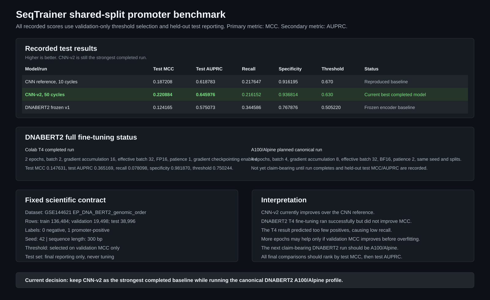

# DNABERT2 Benchmark

This folder is for the DNABERT2 promoter-classification benchmark on the same split used by CNN-v2.

## What Stays Fixed

- Dataset: GSE144621 promoter classification split.
- Split files:
  - `data/promoter_classification/train_EP_DNA_BERT2_genomic_order.csv`
  - `data/promoter_classification/eval_EP_DNA_BERT2_genomic_order.csv`
  - `data/promoter_classification/test_EP_DNA_BERT2_genomic_order.csv`
- Seed: `42`.
- Threshold: selected on validation MCC only.
- Final comparison: held-out test MCC first, held-out test AUPRC second.

## Files

- `dnabert2_shared_split_benchmark_colab.ipynb`: current Colab benchmark with
  the same Conda-based execution pattern as the original working DNABERT2
  notebook, plus the shared CNN split, validation-only threshold selection,
  complete metric table, training curves, threshold analysis, confusion
  matrices, ROC/PR curves, and optional CNN-v2 comparison.
- `dnabert2_v2_colab_hpc.ipynb`: descriptive v2 experiment driver. It can run
  a bounded Colab profile or generate and submit the longer Alpine profile.
- `dnabert2_v2_experiment.py`: shared experiment implementation used by both
  Colab and Alpine.
- `alpine_dnabert2_v2.sbatch`: one-GPU Alpine A100 submission template.
- `assets/RESULTS.md`: complete recorded result tables and plain-language model,
  data, architecture, optimization, threshold, runtime, and limitation details.
- `assets/cnn_dnabert2_comparison.svg`: readable summary of scores and settings.

## Why V2 Exists

The first frozen run used a full-dataset classifier update per epoch. That
produced only about 50 optimizer updates and underused the cached embeddings.
V2 trains the classifier head with shuffled mini-batches, early stopping, and
validation-only candidate selection.

The bounded ablations are:

- BPE token length `70` (official 300 bp reference), `104`, and `128`.
- Mean, CLS, and max pooling.
- Linear and regularized MLP heads.
- Head learning rates `3e-4` and `1e-3`.
- Seeds `42`, `43`, and `44` on Alpine.

The test split is evaluated only after the candidate is selected by mean
validation MCC, with mean validation AUPRC as a tie-break.

## Recorded Results



The assets now record three completed result sets:

1. CNN reference.
2. CNN-v2, which is the current strongest CNN baseline.
3. DNABERT2 runs:
   - frozen DNABERT2-v1,
   - full DNABERT2 fine-tuning on Colab T4.

Open `assets/RESULTS.md` for the complete tables.

### Current Score Summary

| Model/run | Test MCC | Test AUPRC | Status |
| --- | ---: | ---: | --- |
| CNN reference | 0.187208 | 0.618783 | Reproduced baseline |
| CNN-v2, 50 cycles | **0.220884** | **0.645976** | Current best recorded model |
| DNABERT2 frozen v1 | 0.124165 | 0.575073 | Reproducible frozen baseline |
| DNABERT2 full fine-tuning, Colab T4 | 0.147631 | 0.365169 | Completed T4 workflow check |

The Colab T4 full fine-tuning run completed and wrote the expected artifacts,
but it did not improve over CNN-v2. It had high specificity but very low recall,
so it predicted too few promoter-positive examples. The T4 result is therefore
useful as a resource-constrained reproducibility check, not as the final
claim-bearing DNABERT2 result.

The next DNABERT2 step is to run the A100/Alpine full fine-tuning profile and
verify the exact split files before comparing against CNN-v2.

### T4 vs A100/Alpine Profile Difference

Both profiles keep the same scientific comparison contract: same predefined
split names, seed `42`, DNABERT2 backbone, full encoder fine-tuning, mean
pooling, AdamW, learning rate `3e-5`, validation-MCC threshold selection, and
held-out test reporting.

| Setting | Colab T4 profile | A100/Alpine profile |
| --- | ---: | ---: |
| Maximum epochs | 2 | 4 |
| Physical batch size | 2 | 4 |
| Gradient accumulation | 16 | 8 |
| Effective batch size | 32 | 32 |
| Precision | FP16 | BF16 |
| Early-stopping patience | 1 | 2 |
| Gradient checkpointing | Enabled | Not required in the canonical profile |
| Purpose | Resource-constrained reproducibility run | Canonical claim-bearing fine-tuning run |

## Run In Colab

Open:

<https://colab.research.google.com/github/simplyshree/SeqTrainer/blob/issue-3-all-model-baselines/notebooks/benchmarks_sg/dnabert_benchmark/dnabert2_shared_split_benchmark_colab.ipynb>

Use a T4 GPU for an initial run. If the full embedding extraction exceeds the
free Colab session limit, run the same package config on Alpine A100/L40
hardware without changing the split, seed, threshold, or metric policy.

Step 1 installs CondaColab and restarts the runtime. After Colab reconnects,
continue from Step 2. The one-sequence preflight must succeed before starting
the full embedding extraction.

## Compare With CNN-v2

After the full DNABERT2 run finishes:

```bash
seqtrainer benchmark compare \
  outputs/benchmarks/cnn_v2_regularized_ep_genomic_order \
  outputs/benchmarks/dnabert2_frozen_ep_genomic_order \
  --output-dir outputs/benchmarks/comparison_cnn_v2_dnabert2
```

## DNABERT Family Plan

Start with DNABERT2 frozen v2. Fine-tune only the best validation-selected
setting later, using the same split and validation policy. DNABERT-6 and
DNABERT-S are separate model-family experiments and should not be mixed into
this DNABERT2 benchmark.

## Scientific References

- Official implementation: <https://github.com/MAGICS-LAB/DNABERT_2>
- Official model card: <https://huggingface.co/zhihan1996/DNABERT-2-117M>
- DNABERT2 paper: <https://arxiv.org/abs/2306.15006>
- Alpine hardware: <https://curc.readthedocs.io/en/latest/clusters/alpine/alpine-hardware.html>
